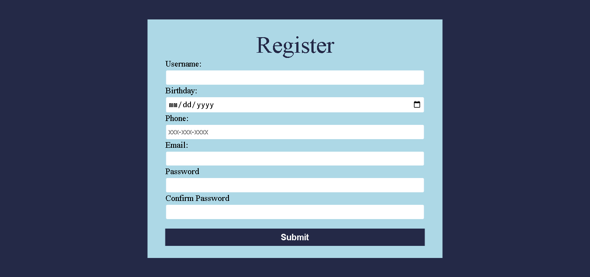

# Form Validation Project

## 🚀 Introduction

Welcome to the Form Validation Practice project! This mini JavaScript project is designed for those who are eager to enhance their skills in form validation. By completing this project, you'll gain hands-on experience in creating a simple yet effective form validation system using HTML, CSS, and JavaScript.

## 📝 Project Overview

The project focuses on creating a registration form with various fields, including username, birthday, phone number, email, password, and password confirmation. The goal is to ensure that users provide valid information before submitting the form. The form validation is handled using JavaScript functions.

## 🛠 Technologies Used

- HTML
- CSS
- JavaScript

## 📄 Project Structure

- **index.html:** The main HTML file that contains the structure of the registration form.
- **style.css:** The CSS file for styling the registration form.
- **script:** The JavaScript containing functions for form validation.

## 🎯 Project Objectives

1. **Username Validation:**
   - Ensure the username is at least 5 characters long.

2. **Email Validation:**
   - Check if the email follows a valid format.

3. **Phone Number Validation:**
   - Validate phone numbers in the format `xxx-xxx-xxxx`.
   - Accept an optional country code.

4. **Password Validation:**
   - Verify that the password is at least 8 characters long.
   - Require a mix of uppercase and lowercase letters.

5. **Password Confirmation:**
   - Confirm that the password and password confirmation match.

## 🧪 How to Use

1. Open the `index.html` file in your preferred web browser.
2. Fill out the registration form with various inputs.
3. Observe the real-time validation messages for each field.
4. Submit the form if all validations pass.

## 🌐 Live Demo

You can check out a repositry for code of this project [here](https://github.com/ayeshasikander/form-validation.git).

## 🌟 Learning Outcome

By completing this project, you will have gained practical experience in form validation techniques using JavaScript. This project serves as a foundation for understanding how to enhance user experience by ensuring data integrity through effective form validation.

Feel free to explore and modify the code to further customize the form or add more advanced validation features!

Happy coding! 🚀